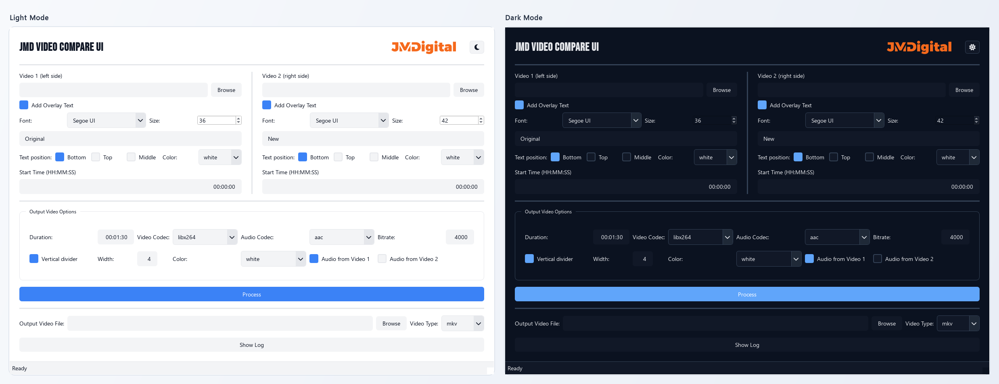

# JMD Video Compare UI

JMD Video Compare UI is a Windows video comparison tool built with PyQt6 and FFmpeg.  
It creates side-by-side comparison outputs for quality checks (AI interpolation, upscaling, restoration, codec comparisons, and similar workflows).

## Current Architecture

This project is now a native PyQt6 application (not a Qt Creator `.ui` generated workflow).

- GUI and CLI share a unified entrypoint: `app.py`
- GUI path: `mainwindow.py`
- Headless CLI path: `app_cli.py`
- Shared FFmpeg runtime detection/download: `ffmpeg_runtime.py`

## Features

- Side-by-side comparison generation from two source videos
- Independent start times and shared output duration
- Text overlays per video with custom text, font family/file, font size, position, and color
- Output controls for video codec, audio codec, bitrate, and output type (`mkv`, `mp4`, `avi`, `mov`, `flv`, `wmv`, `webm`)
- Optional vertical divider with color/width
- Audio source selection (`video1`, `video2`, or none)
- Light and dark theme support with startup system-theme detection
- Font Awesome based UI icons/controls
- Persistent user settings (saved on change)
- Browse dialogs remember last-used folders
- Built-in FFmpeg runtime setup with system detection, cache fallback, and first-run download
- Headless CLI mode for automation without loading GUI modules

## Requirements

- Windows 10 or later
- Python 3.11+ (for running from source)
- FFmpeg on `PATH` (optional, auto-download is supported)
- Internet connection on first run only if FFmpeg is not already available

## Run From Source

From repository root:

```bat
run.bat
```

This launches the GUI (`app.py` -> GUI path).

Headless commands from source:

```bat
run.bat ffmpeg-test
run.bat process --help
```

## Build EXE

From repository root:

```bat
build.bat
```

Output:

`JMD-VideoCompare-UI\dist\JMD-VideoCompare-UI.exe`

## CLI (Headless) Usage

The EXE supports two headless subcommands:

1. `ffmpeg-test`
2. `process`

Show command help:

```bat
JMD-VideoCompare-UI.exe process --help
```

### FFmpeg Runtime Test

```bat
JMD-VideoCompare-UI.exe ffmpeg-test
JMD-VideoCompare-UI.exe ffmpeg-test --force-download
```

### Process Example

```bat
JMD-VideoCompare-UI.exe process ^
  --video1 "C:\Temp\input1.mp4" ^
  --video2 "C:\Temp\input2.mp4" ^
  --output "C:\Temp\result" ^
  --output-type mkv ^
  --start1 00:00:00 ^
  --start2 00:00:00 ^
  --duration 00:00:15 ^
  --video-codec libx264 ^
  --audio-codec aac ^
  --bitrate 4000 ^
  --divider --divider-width 4 --divider-color white ^
  --audio-source video1 ^
  --text1-enable --text1 "Original" --text1-font-family "Segoe UI" --text1-font-size 36 --text1-color white --text1-position bottom ^
  --text2-enable --text2 "New" --text2-font-family "Segoe UI" --text2-font-size 42 --text2-color white --text2-position bottom
```

Use `--dry-run` to print the generated FFmpeg command without running it.

## FFmpeg Resolution Order

At startup/CLI runtime, FFmpeg is resolved in this order:

1. System `PATH`
2. Bundled `bin` folder (if present)
3. Cached runtime in `%LOCALAPPDATA%\JMDigital\JMD-VideoCompare-UI\ffmpeg-runtime`
4. Download and cache runtime automatically

## Preview



## Contributing
Contributions to the project are welcome! Please feel free to submit pull requests or open issues for bugs, feature requests, or enhancements.

## Disclaimer
This tool is developed for educational and professional use. It is not intended for commercial distribution.

## Contact
For any queries or support, please open an issue.

---

Developed with ❤️ by JMDigital
