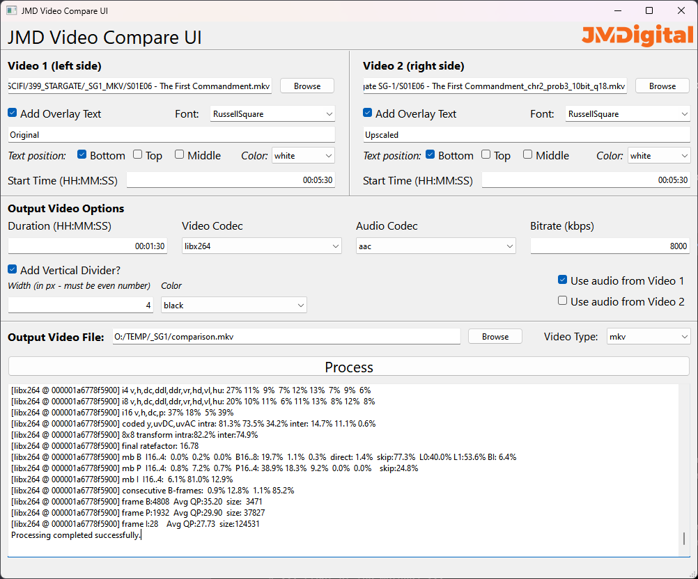

# JMD VideoCompare UI
 A simple video comparison creator written in PyQt
 
## Overview
JMD's VideoCompare UI is a specialized utility designed for comparing two video files visually. It is particularly useful for assessing the quality of video processing techniques, such as AI interpolation, frame rate conversion, and video enhancements.

## Features
- **Dual Video Conversion**: Simultaneously converts two videos to be side-by-side for easy comparison.
- **Custom Start Times and Duration**: Set different start times and a specific duration for each video.
- **Dynamic Text Overlay**: Add customizable text overlays to each video for labeling or commentary.
- **Font Customization**: Choose custom fonts for text overlays directly from the system's font library.
- **Resolution Adjustment**: Automatically scales videos to match resolutions for a uniform comparison experience.
- **Codec Selection**: Offers a variety of codecs for video and audio processing.
- **Frame Rate Synchronization**: Ensures both videos play at the same frame rate for accurate comparison.
- **Audio Source Selection**: Choose which video's audio track to play during the comparison.
- **Output Customization**: Users can specify output format, bitrate, and other encoding options.
- **User-Friendly Interface**: Intuitive GUI for easy operation, requiring minimal technical knowledge.

## System Requirements
- Operating System: Windows 10 or later.

## Built with
- Qt Creator 12
- Python 3.9
- FFmpeg for backend video processing.

## Preview

## Contributing
Contributions to the project are welcome! Please feel free to submit pull requests or open issues for bugs, feature requests, or enhancements.

## Disclaimer
This tool is developed for educational and professional use. It is not intended for commercial distribution.

## Contact
For any queries or support, please open an issue.

---

Developed with ❤️ by JMDigital
